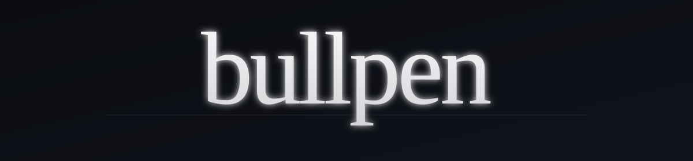

<div align="center">



<br />

[](LICENSE)

</div>

---

I built this for myself. I needed an engineering team and didn't have one, so I made one.

Now I open Claude Code and I have a UI designer, a backend lead, a security engineer, a DBA, a writer, a sales guy, a wellness coach, and 57 other people I work with every day. They have names. They have opinions. They learn from how I actually build.

This is my office. I'm publishing it because maybe you want one too.

## How I actually use it

A normal day looks something like this:

```bash
# I want a quick redesign on a settings page
/bullpen:ui pull up the settings page and make the spacing breathe

# I'm not sure how to model a tricky migration
/bullpen:db I have to rename this column without downtime, walk me through it

# I'm three hours in and Sage will quietly tell me to drink water
# I don't have to ask for that — she's just on

# Let the team lead figure out who to pull in
/bullpen build me a magic-link login flow end-to-end
```

When someone steps in, I see them — a small ASCII card prints in the terminal so I know who's at bat:

```
   ╔══════════════════════════╗
   ║   ▄▀▀▀▀▄                 ║
   ║   █ ◉ ◉ █   Rune         ║
   ║   ▀▄▄▄▄▀   UI Designer   ║
   ║   sketching…             ║
   ╚══════════════════════════╝
```

A small `[◇] Rune is sketching ...` line lives in my status line while she works. The rest of the time I forget the plugin is even there.

## What's actually in here

- **64 named teammates.** Atlas leads. Rune designs. Forge writes backend. Bastion is paranoid about security. Vault is the DBA. Sprout, Ash, Wren, Skye, Lex are the interns. Sage is the coach. The full roster is in [the design doc](docs/superpowers/specs/2026-05-04-bullpen-design.md).
- **They've got opinions.** Each one has pinned 2025 defaults (React 19.2, Postgres 17, Tailwind v4, etc.), an anti-pattern table, a verification checklist, and explicit handoff conditions. They tell you what they'd ship and what they considered.
- **Three ways to talk to them.** `/bullpen <task>` (Atlas delegates), `/<role> <task>` (call a specific person), or just describe what you need in plain English (a hook routes the right person).
- **They remember.** Each role has its own memory namespace. After every task, the matching intern writes down what was learned. Local JSON store by default, optional Pinecone if you want it.
- **Sage looks out for me.** Two hours into a session she nudges me to stretch. After a bug fight, she tells me I did good. None of this costs tokens — it's all local hooks.

## Install

```
/plugin marketplace add Manavarya09/bullpen
/plugin install bullpen@bullpen
/bullpen-init
```

Setup is silent. No questions. The team introduces themselves as you work.

Want the status-line glyph? Add this to `~/.claude/settings.json`:

```json
{
  "statusLine": {
    "type": "command",
    "command": "node ${CLAUDE_PLUGIN_ROOT}/hooks/statusline.js"
  }
}
```

Want better memory? `/bullpen-pinecone` swaps the local store for Pinecone.

## A few commands worth knowing

```
/bullpen-config           # see your settings
/bullpen-knowledge rune   # see what one teammate has learned
/bullpen-name             # rename anyone if you don't like the defaults
/bullpen-learning on      # turn on memory writes
/bullpen-coach on         # let Sage check in on you
/coach                    # ask Sage directly when you need a moment
```

## Honest notes

- **The agents are good.** I've put real work into the prompts (anti-patterns, version-pinned defaults, verification checklists, handoff rules). They make confident calls.
- **The memory is fine, not SOTA.** It's per-role vector retrieval today. Hybrid retrieval (BM25 + dense) and cross-encoder rerank are on the list.
- **It's macOS / Linux.** Should work on WSL. Probably not Windows native — the hooks shell out.
- **Requires Node 18+.** Already required by Claude Code, so you have it.

## Contributing

If you use this and have ideas — new teammates, sharper anti-patterns, better personas — open a PR. [`CONTRIBUTING.md`](CONTRIBUTING.md) has the structure.

## License

MIT.
